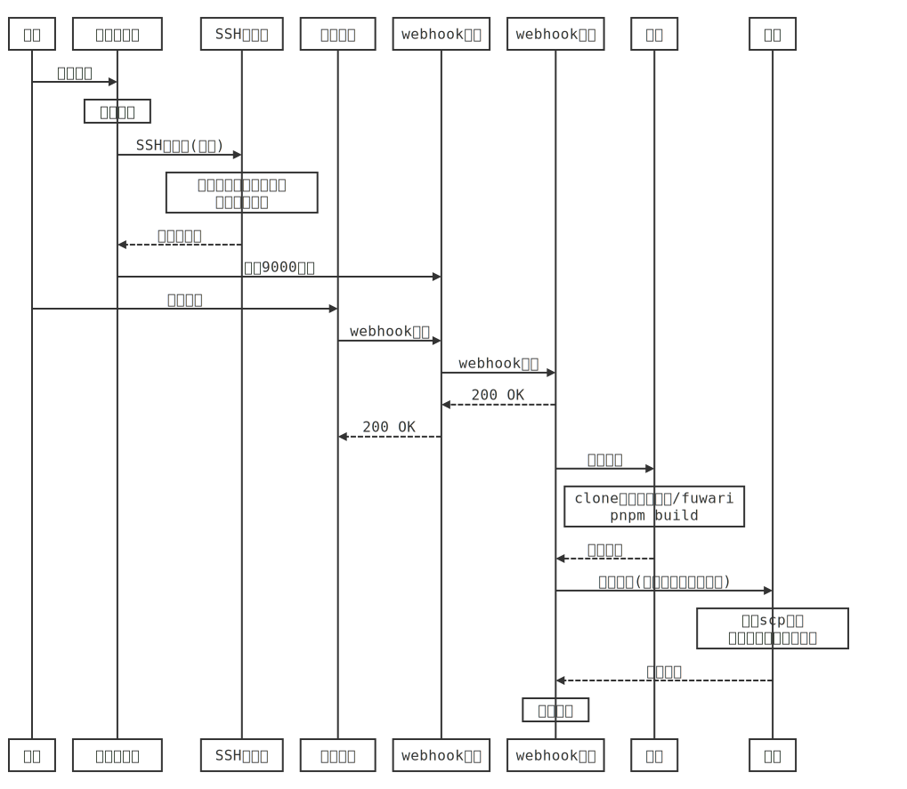

# docker-fuwari

> :whale:支持稿件存储在外部git仓库/持续集成的fuwari主题日志仓库
>
> 📦*Dockerized Fuwari-themed blog with Outbound repo and CI Support*

本项目基于[saicaca/fuwari: ✨A static blog template built with Astro.](https://github.com/saicaca/fuwari)


## 项目特点

> :writing_hand:只需一条git push，剩下的交给它。​

- ⚡**快速安装：**仅需一条指令；
- 🧩**稿件-配置分离：**分离源稿件管理与Fuwari主题配置，最大程度防止稿件丢失；
- ✔️**多托管平台支持：**支持源稿件存储在容器外部，如github、gitea等远程/自建托管平台；
- :hammer:**自动拉取&生成：**自动从源稿件仓库拉取markdown稿件&生成目标网页文件；
- :cloud:**支持自动部署到云端：**自动将目标网页文件上传到部署服务器。


## 词汇表

> *Fuwari is A static blog template built with [Astro](https://astro.build/),支持多种语言。*

为避免歧义，首先明确本文档所使用的专有词汇：

- **docker宿主机：**运行本容器的服务器；
- **源稿件：**你撰写的原始稿件，一般为markdown格式；
- **源稿件（托管）仓库：**用来对源稿件进行版本管理的git仓库，其层次结构见”源稿件托管仓库文件结构“一节；
- **目标网页文件：**使用`pnpm build`命令，从源稿件生成的静态网页文件；
- **部署服务器：**用来部署目标网页文件，提供外部访问的服务器。


## 开始使用

### 前置要求

安装前，请确认具备如下条件，否则本容器无法正常工作：

- [ ] **源稿件托管仓库可以向本容器发送Webhook信息；**

- [ ] **(如需部署)部署服务器支持以SSH公钥方式进行访问验证。**

> 其中，第一点通常意味着以下要求至少满足其一：
>
> - 源稿件托管仓库为自建平台（如自建gitea），且docker宿主机与托管平台在同一个局域网；
> - 源稿件托管仓库为远程平台（如github），且docker宿主机具有公网IP/可以将其端口映射到公网。


### 安装

#### 安装方式1：单指令安装

```shell
docker run -d \
  --name docker_fuwari_with_outbound_repo \
  --restart always \
  -p 9000:9000 \                             # webhook的监听端口，用于侦听稿件托管平台
  -v /your/path/to/store/keys:/root/.ssh \   # 非必须设置:挂载一个外部目录存储SSH密钥
  -v /your/path/to/store/fuwari/files:/fuwari \  # 非必须设置:挂载一个外部目录方便配置
  # 必须设置：以下设置容器内部git信息，用于从稿件托管仓库拉取稿件
  -e GIT_USER_NAME="your_git_user_name" \
  -e GIT_USER_EMAIL="your_email@example.com" \
  # 必须设置：稿件托管仓库的登陆信息
  # 仓库URL形如ssh://$REPO_USER_NAME@$REPO_IP:REPO_SSH_PORT/REPO_NAME.git
  # 以本项目为例，
  # $REPO_USER_NAME == git
  # $REPO_IP == github.com(域名) 或 x.x.x.x (ipv4) 或 [x::x] (ipv6)
  # $REPO_SSH_PORT == 22
  # $REPO_NAME == Li-O-Li/docker-fuwari
  -e REPO_USER_NAME="your_repo_user_name" \
  -e REPO_IP="your_repo_ip" \
  -e REPO_SSH_PORT="22" \
  -e REPO_NAME="your_repo_name" \
  # 非必须设置:部署服务器的登陆信息
  # 如果不需要部署，不设置这四个变量即可
  # 假设需要以root登陆，向x.x.x.x服务器的/www/fuwari/文件夹中部署生成的网页文件。
  # $DEPLOY_USER_NAME == root
  # $DEPLOY_IP == x.x.x.x (ipv4) 或 [x::x] (ipv6)
  # $DEPLOY_SSH_PORT == 22
  # $DEPLOY_FOLDER == /www/fuwari/ (注意最后的斜杠)
  -e DEPLOY_USER_NAME="$DEPLOY_USER_NAME" \
  -e DEPLOY_IP="$DEPLOY_IP" \
  -e DEPLOY_SSH_PORT="22" \
  -e DEPLOY_FOLDER="$DEPLOY_FOLDER" \
  lithiumhydroxide/docker-fuwari:latest
```

:information_source:**运行完成后，请转至“安装后的配置”一节继续配置。**

#### 安装方式2：使用Docker Compose安装（推荐）

> :star:推荐使用docker compose管理该容器。

1. 将项目目录下的`docker-compose.yml`以及`.env_file`文件下载至本地，存储在同一个文件夹中；

2. 修改两文件的内容

   ```yaml
   # docker-compose.yml
   services:
     fuwari:
       image: lithiumhydroxide/docker-fuwari:latest
       container_name: docker_fuwari_with_outbound_repo
       restart: always
       env_file:
         - .env_file
       ports:
         - "9000:9000"   						# webhook外部映射接口，按需修改。
       volumes:
         - /your/path/to/store/keys:/root/.ssh   # 按需修改或删除
         - /your/path/to/store/fuwari/files:/fuwari  # 按需修改或删除
   
   # .env_file
   # 变量含义见"单指令安装"的注释。
   GIT_USER_NAME="your_name"
   GIT_USER_EMAIL="your_email"
   
   REPO_USER_NAME="your_repo_user_name"
   REPO_IP="your_repo_ip"
   REPO_SSH_PORT="22"
   REPO_NAME="your_repo_name"
   
   DEPLOY_USER_NAME="your_user_name_of_deploy_server"
   DEPLOY_IP="your_deploy_server_ip"
   DEPLOY_SSH_PORT="22"
   DEPLOY_FOLDER="folder_of_index_html_on_deploy_server"
   ```

3. 运行容器

   ```shell
   cd /folder/of/compose/file
   docker compose up -d
   ```

:information_source:**运行完成后，请转至“安装后的配置”一节继续配置。**


### 安装后的配置

> :construction:为实现自动化稿件拉取与部署，需对源稿件托管仓库的SSH密钥、Webhook以及远程部署仓库的SSH密钥进行配置。
>

#### （必须）前置条件：获取本容器的SSH密钥

```shell
# 安装过程中，本容器会自动生成一对ed25519 SSH密钥。
# 为了获取公钥，可以在宿主机运行以下命令查看docker日志
docker logs [容器名称]

# 从log中查看公钥：将会有形如"public key = xxxx"的记录，将对应条目记录下来
```

#### （必须）添加SSH密钥到源稿件托管仓库

> :lock:将SSH密钥添加到稿件托管仓库，赋予容器拉取稿件仓库的权限。
>

以Github为例，其它托管仓库的操作方式类似：

1. 打开仓库->设置->安全->部署密钥；
2. 点击右上角的"添加密钥"；
3. 将步骤1获得的容器公钥添加到对应稿件仓库(无需勾选写入权限)。

#### （必须）配置源稿件托管仓库Webhook

> :building_construction:在发生推送事件时，使用webhook通知本容器。
>

以Github为例，其它托管仓库的操作方式类似：

1. 打开仓库->设置->Webhooks；

2. 点击右上角的"添加webhook"；

3. 配置Webhook：

  - [ ] 负载URL:`http://[your_container_server_ip]:[your_container_port]`；


  ​	*假设docker宿主机具有公网IP 1.1.1.1，宿主机的9000端口映射到容器的9000端口(9000:9000)，则：*

  ​	*Payload URL == "http://1.1.1.1:9000"*

  - [ ] 内容类型:随意选择；


  - [ ] 密钥:留空；


  - [ ] SSL验证:如果宿主机已配置https，则保持enable；否则请选择Disable；


  - [ ] 触发事件：仅push事件；


  - [ ] 启用：勾选。

#### （非必须）添加SSH密钥到部署服务器

> :cloud:如果在安装容器时配置了部署服务器相关信息，则需执行此步。
>

```shell
# 示例：以root用户登陆22端口，向100.100.100.100服务器的/www/fuwari/文件夹中部署生成的网页文件。
# 部署服务器使用openssh

# 此条本地执行。
ssh root@100.100.100.100  # 本地执行，登陆到远程部署服务器

# 以下在远程部署服务器执行。
# 如非root用户，此条需注意sudo与目标文件路径，可能为/home/[用户名]/.ssh/authorized_keys
vi /root/.ssh/authorized_keys

# 将容器密钥添加到新的一行，保存退出
# 按需重启sshd服务
```

**:white_check_mark:至此，本容器部署完成~**

:information_source:请继续阅读**“稿件托管仓库文件结构”**一节。


### 源稿件托管仓库文件结构

> :world_map:与本容器配套使用的源稿件托管仓库需要满足一定的层次结构。

参考fuwari的文件夹结构，创建一个如下的git仓库：

```shell
.
├── .git/
├── src/content/posts/
	├── readme.md
```

将你的稿件放在/src/content/posts/文件夹下即可，其格式参考Fuwari文档，典型标头如下。

```markdown
---
title: My First Blog Post
published: 2023-09-09
description: This is the first post of my new Astro blog.
image: ./cover.jpg
tags: [Foo, Bar]
category: Front-end
draft: false
lang: jp      # Set only if the post's language differs from the site's language in `config.ts`
---

...  # 你的实际文档内容
```

:smiley:**到这里，你的容器已经可以运行了。**

**现在，你只要推送源文档到源稿件托管仓库（当然，得是main分支），本容器便会完成所有生成/部署工作~**

❗**注意：**你也可以在源稿件仓库中存储Fuwari的其它内容，但这就背离了稿件-网站配置隔离的初衷，更推荐的方式请见”安装主题“一节。

🎉**恭喜！你已完成全部步骤**🎉


## 深度使用

> 这里主要说明容器运行逻辑与细节，如果只是想要使用，看上面的"开始使用"内容就可以啦。

### 工作逻辑

本容器内含容器初始化、SSH初始化、webhook侦听、webhook处理、生成、部署等多个脚本，均位于/usr/local/bin/文件夹下。其工作逻辑如下：

```sequence
participant 用户
participant 容器初始化
participant SSH初始化
participant 稿件仓库
participant webhook侦听
participant webhook处理
participant 生成
participant 部署
用户->容器初始化:启动容器
Note over 容器初始化:入口检查
容器初始化->SSH初始化:SSH初始化(请求)
Note over SSH初始化:生成密钥（如不存在）\n添加已知主机
SSH初始化-->容器初始化:初始化好了
容器初始化->webhook侦听:侦听9000端口
用户->稿件仓库:推送稿件
稿件仓库->webhook侦听:webhook请求
webhook侦听->webhook处理:webhook请求
webhook处理-->webhook侦听:200 OK
webhook侦听-->稿件仓库:200 OK
webhook处理->生成:启动生成
Note over 生成:clone源稿件仓库至/fuwari\n pnpm build
生成-->webhook处理:生成好了
webhook处理->部署:启动部署(若配置了部署服务器)
Note over 部署:使用scp命令\n拷贝网页到部署服务器
部署-->webhook处理:部署好了
Note over webhook处理:处理完毕
```



#### 容器初始化

对应entry.sh脚本，在容器启动时自动执行。

该脚本将依次执行以下步骤：

1. **变量检查**

| 序号 |     检验变量     |      要求      |         含义         |
| :--: | :--------------: | :------------: | :------------------: |
|  1   |  GIT_USER_NAME   |      必须      |   容器内GIT用户名    |
|  2   |  GIT_USER_EMAIL  |      必须      |    容器内GIT邮箱     |
|  3   |  REPO_USER_NAME  |      必须      |   源稿件仓库用户名   |
|  4   |     REPO_IP      |      必须      |  源稿件仓库IP/域名   |
|  5   |  REPO_SSH_PORT   | 非必须，默认22 |  源稿件仓库SSH端口   |
|  6   |    REPO_NAME     |      必须      |     源稿件仓库名     |
|  7   | DEPLOY_USER_NAME |     非必须     |   部署服务器用户名   |
|  8   |    DEPLOY_IP     |     非必须     |  部署服务器IP/域名   |
|  9   | DEPLOY_SSH_PORT  | 非必须，默认22 |  部署服务器SSH端口   |
|  10  |  DEPLOY_FOLDER   |     非必须     | 部署服务器目标文件夹 |

其中，不设置三个无默认值的DEPLOY_*变量不会导致容器启动失败，但后续将直接跳过部署步骤。

2. **如果不存在/fuwari/.delete_me_to_restore文件，则将/fuwari_backup.tar.xz中的文件镜像释放到/fuwari/；**
   - 其中/fuwari_backup.tar.xz提供了一套完整的fuwari初始副本；
3. **启动SSH初始化**
4. **SSH初始化完成后，在9000端口侦听webhook**

#### SSH初始化

对应ssh_setup.sh脚本。

该脚本执行以下内容：

1. 检查/root/.ssh/文件夹下是否存在名为"id_ed25519"与"id_ed25519.pub"的公私钥；
2. 如果不存在，则生成一对；
3. 将公钥打印到docker log；
4. 检测REPO_IP:REPO_SSH_PORT与DEPLOY_IP:DEPLOY_SSH_PORT主机的SSH密钥，将其加入known_hosts名单。

#### webhook侦听

对应webhook_listener.sh。

该脚本使用socat监听9000端口，将对其产生的访问转发由handle_wenhook.sh脚本处理；

#### webhook处理

对应handle_wenhook.sh。

该脚本执行以下内容：

1. 产生最小HTTP响应(200 OK)，返回到稿件仓库；
2. 启动生成脚本；
3. 启动部署脚本（若容器初始化时，发现DEPLOY_*变量均已设置）。

#### 生成

对应auto_pull_and_build.sh

该脚本执行以下内容：

1. 将稿件管理仓库克隆到/tmp/source_files文件夹下；
2. 将/tmp/source_files文件夹下内容复制**（强制覆盖模式）**到/fuwari；
3. 启动构建；


#### 部署

对应auto_deploy.sh

该脚本通过scp -qrC 命令，将/fuwari/dist中的所有文件拷贝到部署服务器上的目标文件夹。

❗**注意：**不会在目标文件夹内创建子文件夹。

### 从Dockerfile构建镜像

如果希望从Dockerfile自行构建镜像，可以对docker compose文件进行小幅修改。

```dockerfile
# image: lithiumhydroxide/docker-fuwari:latest  # 注释掉这一行
build: ./fuwari  # 添加本行
```


## 常见问题

### :recycle:安装主题时我不小心搞砸了，可以将/fuwari文件夹重置为初始状态吗？

✔️可以！

本容器每次启动时，都会检测/fuwari/.delete_me_to_restore文件是否存在。

只要把这个文件删除，重启容器，那么整个/fuwari文件夹都会恢复到初始状态。

### 为什么源文档仓库发出webhook后收不到响应？

导致这一问题的可能性比较多，建议检查如下条目：

- webhook URL设置是否正确；
- docker宿主机的防火墙配置是否正确；
- 如果使用了反向代理/端口映射关系是否正确，防火墙配置是否正确；
- 可能存在网络波动。


### 为什么原文档仓库受到了200 OK响应，但部署服务器上看不到网页文件？

导致这一问题的可能性也较多，包括不限于：

- 源稿件仓库的URL配置不正确；
- 未正确添加容器SSH密钥至源稿件仓库；
- 未正确配置部署服务器URL；
- 未正确配置部署文件夹路径（检查结尾的/）；
- 未正确添加容器SSH密钥至部署服务器；
- 部署服务器不支持公钥登录。

使用`docker logs`命令检查容器工作状态以获得更多信息。


## 许可

本程序使用MIT授权。
